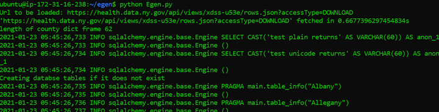
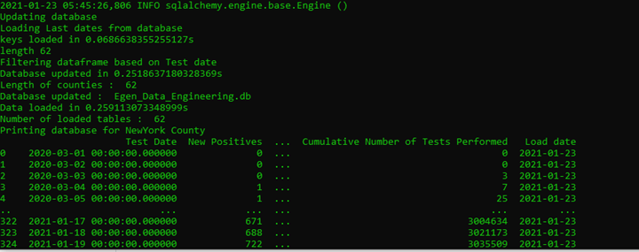
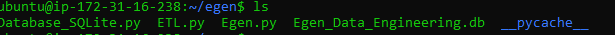
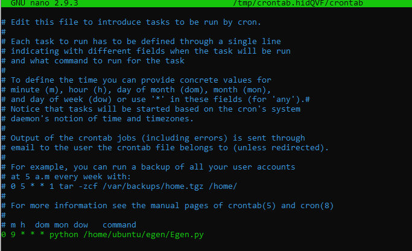

# **Data Engineering Task Documentation:**

By Arun Thomas Varughese (athomasv@andrew.cmu.edu)

# Overview:

In this project, I used ETL to extract data from link: [https://health.data.ny.gov/api/views/xdss-u53e/rows.json?accessType=DOWNLOAD](https://health.data.ny.gov/api/views/xdss-u53e/rows.json?accessType=DOWNLOAD) and transform the data into an easier format for loading into an sqLite database.

I have created 3 classes to handle Extraction, Transformation and Loading. They are:

1. Data\_Extractor

2. Data\_Transformer

3. Database\_SQLite

Data\_Extractor: Extracts data from url and loads it in json format.

Data\_Transformer: Transforms json file into pandas dataframe and groups data based on county. It also converts json data to appropriate data types.

Database\_SQLite: This class is used to manage SQLite database. It is used to load pandas dataframes to SQL and also check the rows that are needed to be updated. It also has functions to load data from database to a pandas dataframe.

Important Features:

1. The ETL program is designed using OOP.
2. We make use of Pandas dataframes for Transformation.
3. Df\_dict is commonly used in program. This represents a dictionary of dataframes based on county name as key values.
4. The program supports multi-threading for loading data from multiple tables and updating data to multiple tables in one database simultaneously. We make use of multiple dataframes for each county to handle this easily.
5. I made use of a simple database with name &quot;Egen\_Data\_Engineering.db&quot; for this program.
6. We use &quot;Test Date&quot; as primary key for the tables as I could find that it is unique for each county and can be used for identification.
7. Test date is used to filter new data before updating new information to database. This ensures that rows already present are not reuploaded and this saves time for daily job.
8. The solution database is provided for reference
9. Please install libraries mentioned in requirements section.

# Requirements:

Please install the following libraries:

1. pandas

2. numpy

3. sqlalchemy

4. urllib

Commands for installation:

pip install pandas

pip install numpy

pip install sqlalchemy

pip install urllib3

or

pip install urllib (based on system)

# Implementation Sample:

1. Unzip egen.zip file
2. It contains three python files: Database\_SQLite.py, ETL.py and Egen.py
3. For running the ETL script:
  1. Make sure you are on the directory which contains the python files.
  2. Run cmd based on your system:

python3 Egen.py

or

python Egen.py

As you can see, we see logs that show that extraction is completed and that url was fetched in 0.66 s.

We also time taken to load last dates from database as 0.068 s

We see that updating database took 0.25 s

Finally, we can see the dataframe loaded from SQLite for NewYork county and its contents.

A new database is created in the same folder if it is not already present.

1. For setting up cron job use:
  1. crontab -e
  2. use either bash script or terminal to update crontab as shown in screenshot.

